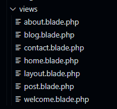
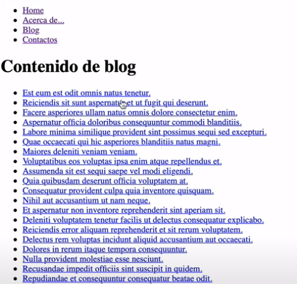

<p align="center"><a href="https://laravel.com" target="_blank"></a></p>

<p align="center">
<a href="https://travis-ci.org/laravel/framework"></a>
<a href="https://packagist.org/packages/laravel/framework"></a>
<a href="https://packagist.org/packages/laravel/framework"></a>
<a href="https://packagist.org/packages/laravel/framework"></a>
</p>

## Obxectivo

O obxectivo é crear un blog usando as utilidades de Laravel.  Este exercicio está feito usando o videotutorial de Rimorsoft Online que se pode atopar aquí: 

[APRENDE LARAVEL en pocos minutos 🚀 (clase práctica) | Rimorsoft Online - YouTube](https://www.youtube.com/watch?v=nFKwq2PHJ64&t=1515s)

## Preparativos

Creamos un novo proxecto de Laravel mediante o quick app de laragon e empezamos a modificar as rutas do arquivo web.php:

```php
Route :: view('/','home')->name('home');
Route :: view('acerca-de','about')->name('about');

Route::get('blog', 'App\Http\Controllers\BlogController@index') ->name ('blog.index');
Route::get('blog/{post:slug}', 'App\Http\Controllers\BlogController@show') ->name ('blog.show');

Route :: view('contactos','contact')->name('contact');
```

Así a páxina deixará de redirixirnos á páxina por defecto de laravel. Agora debemos modificar as blades para navegar correctamente por cada sección.

### Blades



Temos que facer tantas blades como vaiamos a necesitar

As blades de home, about e contact as deixaremos simplemente cun contido mínimo:

```php
@extends('layout')

@section('content')
    <h1>Contenido de home</h1>
@endsection
```

A blade de layout terá todas as seccións para poder navegar por elas desde calquer sitio da páxina:

```php
<!DOCTYPE html>
<html lang="en">
<head>
    <meta charset="UTF-8">
    <meta http-equiv="X-UA-Compatible" content="IE=edge">
    <meta name="viewport" content="width=device-width, initial-scale=1.0">
    <title>Proyecto Laravel</title>
</head>
<body>
    <ul>
        <li><a href="{{ route('home') }}">Home</a></li>
        <li><a href="{{ route('about') }}">Acerca de</a></li>
        <li><a href="{{ route('blog.index') }}">Blog</a></li>
        <li><a href="{{ route('contact') }}">Contactos</a></li>
    </ul>
    <div>
        @yield('content')
    </div>
</body>
</html>
```

O blade de blog terá unha serie de posts que imos facer:

```php
@extends('layout')

@section('content')
    <h1>Contenido de blog</h1>
<ul>
    @foreach($posts as $post)
    <li>
        <a href="{{ route('blog.show', $post->slug) }}">
            {{ $post->title }}
        </a>
    </li>
    @endforeach
</ul>

@endsection
```

O blade de post terá o contido de cada post para poder poñer no blog:

```php
@extends('layout')

@section('content')

    <h1>{{ $post->title }}</h1>

    {{ $post->body }}

@endsection
```

### Base de datos

Agora toca facer unha base de datos no phpmyadmin e cheala de tablas. para iso primeiro modificamos o arquivo .env coas credenciales e o nome da nosa base de datos.

```php
DB_CONNECTION=mysql
DB_HOST=127.0.0.1
DB_PORT=3306
DB_DATABASE=page
DB_USERNAME=root
DB_PASSWORD=
```

Facemos desde a terminal o modelo de post (php artisan make:model Post) e modificamos o modelo de migracións create_post_table para que teña os campos que nos queiramos:

```php
  public function up()
    {
        Schema::create('posts', function (Blueprint $table) {
            $table->id();

            $table->string('title');
            $table->string('slug');
            $table->text('body');

            $table->timestamps();
        });
    }       });
```

Migramos as tablas desde a terminal e agora temos tablas vacías cos campos que eliximos. Para poboalas, imos usar factory para rechealas de informació falsa. Dentro de factories, modificamos postfactory.php:

```php
$factory->define(Post::class, function (Faker $faker) {
    $title = $faker->sentence;
    return [
        'title'=> $this->faker->sentence(),
        'slug'=> $this->faker->slug(),
        'body'=> $this->faker->paragraph(50),
    ];
});
```

E o seeder modificámolo desta maneira para crear 50 artículos falsos:

```php
class PostSeeder extends Seeder
{
    /**
     * Run the database seeds.
     *
     * @return void
     */
    public function run()
    {
        //
        Post::factory()->account(50)->create();
    }
}
```

Agora só queda poñer na terminal php artisan migrate:refresh --seed e temos 50 posts creados no noso blog, todo con Laravel.


